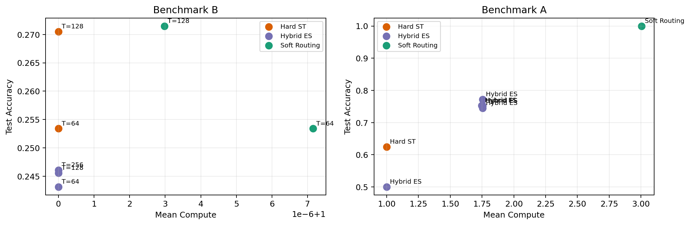
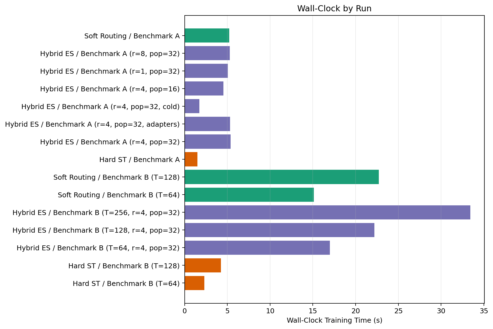
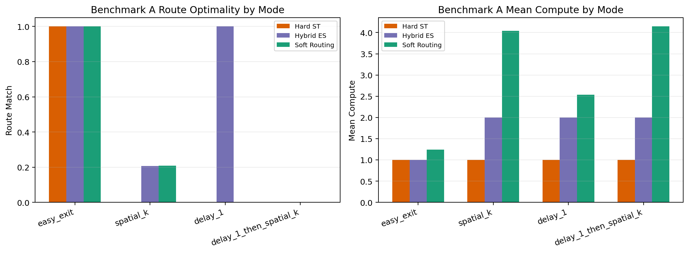
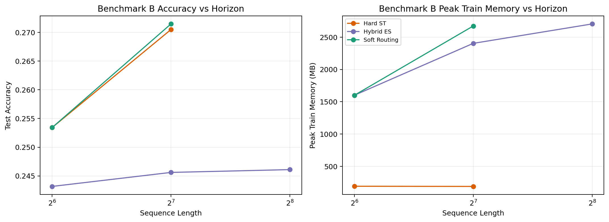

# Packet-Routing GNN Experiment Report

## Scope

This report summarizes a synthetic packet-routing GNN experiment suite. The hybrid ES condition is **EGGROLL-inspired**, not a claim of exact EGGROLL reproduction.

Implemented ingredients:

- Hard forward-pass routing with `FORWARD`, `EXIT`, and `DELAY` actions.
- A soft-routing BPTT baseline, a hard-routing straight-through baseline, and a hybrid low-rank ES method.
- Low-rank antithetic ES perturbations with deterministic seed reconstruction and 2-GPU population sharding.
- Direct optimization of task quality plus hop, delay, and TTL penalties.

## Completed Runs

Loaded **15** run directories from `results/dev_suite`.

## Headline Plots

## Benchmark A Summary

| Run | Method | Acc | Route Match | Hops | Delays | Compute | Early Exit | Peak Mem MB | Train Time s |
| --- | --- | --- | --- | --- | --- | --- | --- | --- | --- |
| hard_st_benchmark_a | Hard ST | 0.625 | 0.245 | 0.000 | 0.000 | 1.000 | 1.000 | 287.4 | 1.5 |
| hybrid_es_benchmark_a | Hybrid ES | 0.772 | 0.550 | 0.504 | 0.251 | 1.755 | 0.749 | 306.6 | 5.4 |
| hybrid_es_benchmark_a_adapters | Hybrid ES | 0.752 | 0.496 | 0.000 | 0.755 | 1.755 | 0.245 | 306.6 | 5.3 |
| hybrid_es_benchmark_a_nowarm | Hybrid ES | 0.501 | 0.245 | 0.000 | 0.000 | 1.000 | 1.000 | 62.0 | 1.7 |
| hybrid_es_benchmark_a_pop16 | Hybrid ES | 0.753 | 0.496 | 0.000 | 0.747 | 1.747 | 0.253 | 306.6 | 4.5 |
| hybrid_es_benchmark_a_rank1 | Hybrid ES | 0.753 | 0.496 | 0.000 | 0.755 | 1.755 | 0.245 | 306.6 | 5.1 |
| hybrid_es_benchmark_a_rank8 | Hybrid ES | 0.745 | 0.496 | 0.000 | 0.754 | 1.754 | 0.246 | 306.6 | 5.3 |
| soft_benchmark_a | Soft Routing | 1.000 | 0.299 | 1.620 | 0.383 | 3.004 | 0.622 | 306.6 | 5.2 |

## Benchmark B Summary

| Run | Method | Seq Len | Acc | Delays | Compute | Examples/s | Peak Mem MB | Train Time s |
| --- | --- | --- | --- | --- | --- | --- | --- | --- |
| hard_st_benchmark_b | Hard ST | 64 | 0.253 | 0.000 | 1.000 | 20510.0 | 192.4 | 2.3 |
| hard_st_benchmark_b_h128 | Hard ST | 128 | 0.271 | 0.000 | 1.000 | 11727.3 | 189.6 | 4.3 |
| hybrid_es_benchmark_b | Hybrid ES | 64 | 0.243 | 0.000 | 1.000 | 20892.7 | 1600.0 | 17.0 |
| hybrid_es_benchmark_b_h128 | Hybrid ES | 128 | 0.246 | 0.000 | 1.000 | 11379.6 | 2403.5 | 22.2 |
| hybrid_es_benchmark_b_h256 | Hybrid ES | 256 | 0.246 | 0.000 | 1.000 | 6123.1 | 2704.2 | 33.4 |
| soft_benchmark_b | Soft Routing | 64 | 0.253 | 0.000 | 1.000 | 8211.6 | 1600.0 | 15.1 |
| soft_benchmark_b_h128 | Soft Routing | 128 | 0.271 | 0.000 | 1.000 | 4750.6 | 2672.1 | 22.7 |

## Hybrid ES Ablations

| Run | Benchmark | Seq Len | Rank | Population | Warm | Adapters | Acc | Compute | Train Time s |
| --- | --- | --- | --- | --- | --- | --- | --- | --- | --- |
| hybrid_es_benchmark_b | Benchmark B | 64 | 4 | 32 | yes | no | 0.243 | 1.000 | 17.0 |
| hybrid_es_benchmark_b_h128 | Benchmark B | 128 | 4 | 32 | yes | no | 0.246 | 1.000 | 22.2 |
| hybrid_es_benchmark_b_h256 | Benchmark B | 256 | 4 | 32 | yes | no | 0.246 | 1.000 | 33.4 |
| hybrid_es_benchmark_a_rank1 | Benchmark A | 2 | 1 | 32 | yes | no | 0.753 | 1.755 | 5.1 |
| hybrid_es_benchmark_a_pop16 | Benchmark A | 2 | 4 | 16 | yes | no | 0.753 | 1.747 | 4.5 |
| hybrid_es_benchmark_a_nowarm | Benchmark A | 2 | 4 | 32 | no | no | 0.501 | 1.000 | 1.7 |
| hybrid_es_benchmark_a | Benchmark A | 2 | 4 | 32 | yes | no | 0.772 | 1.755 | 5.4 |
| hybrid_es_benchmark_a_adapters | Benchmark A | 2 | 4 | 32 | yes | yes | 0.752 | 1.755 | 5.3 |
| hybrid_es_benchmark_a_rank8 | Benchmark A | 2 | 8 | 32 | yes | no | 0.745 | 1.754 | 5.3 |

## Conclusion

- On Benchmark A, **Soft Routing** won raw accuracy at 1.000, but **Hybrid ES** was the strongest truly hard-routing method: 0.772 accuracy and 0.550 route match, versus 0.625 and 0.245 for Hard ST.
- Hybrid ES also used less mean compute than the soft model on Benchmark A (1.755 vs 3.004), at the cost of lower final accuracy.
- On Benchmark B at the longest common horizon (T=128), all methods stayed near chance: Soft 0.271, Hard ST 0.271, Hybrid ES 0.246.
- As horizon grew from T=64 to T=128, soft-routing training memory rose from 1600.0 MB to 2672.1 MB, while hybrid ES still failed to escape the trivial early-exit policy.
- At the extra hybrid-only point T=256, hybrid ES remained near chance at 0.246 while training time climbed to 33.4 s.
- Warm-starting hybrid ES improved its best observed accuracy from 0.501 to 0.772 in the available ablations.
- Overall verdict: this EGGROLL-inspired approximation looks promising for practical hard-routing search when the main challenge is discrete route selection with compute penalties, but it does not make the current long-horizon delay-memory benchmark practical.
- This is enough evidence to justify further research on better warm-starts or richer memory representations, not to claim a general win over gradient baselines.

## Limitations

- The hybrid method follows the transferable EGGROLL ideas but does not reproduce the paper's exact kernels, shared-activation system, JAX stack, or full reference workloads.
- These benchmarks are synthetic and diagnostic by design. Positive results here do not imply production-scale wins on real graph or sequence tasks.
- The route simulator uses exact one-hot decisions for `route_mode='hard'`, but the state update remains a vectorized PyTorch approximation rather than a sparse custom kernel.
