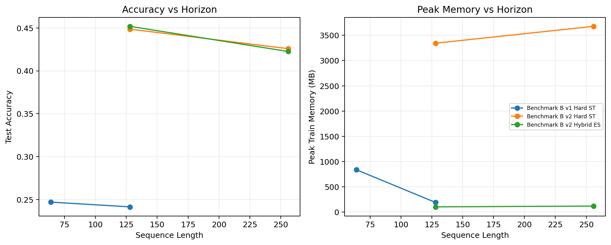
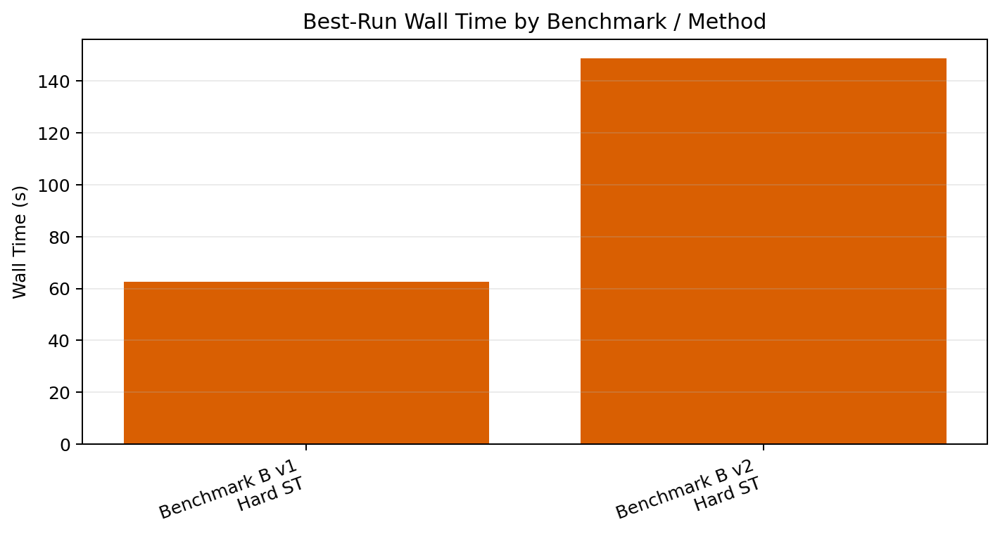
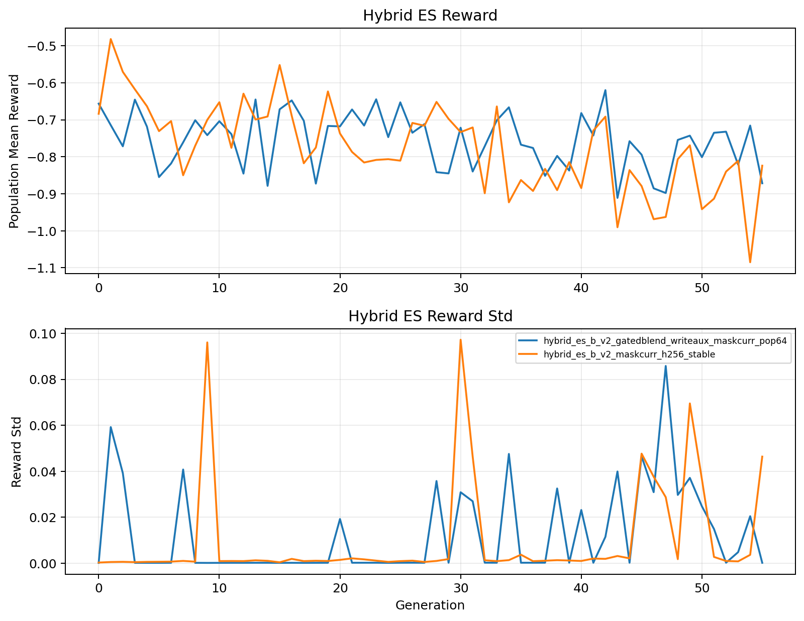

# Phase 2 Report

## Scope

Second-round investigation of the long-horizon hard-routing packet GNN with an emphasis on Benchmark B collapse, route diagnostics, and EGGROLL-inspired hybrid ES follow-ups.

## Repo Start State

- Phase 2 started from `origin/master` at `be1d245`.
- The phase-1 report had already established a negative long-horizon story:
  - `results/dev_suite/hard_st_benchmark_b_h128`: accuracy about `0.271`
  - `results/dev_suite/hybrid_es_benchmark_b_h128`: accuracy about `0.246`
  - both with near-total early exit and essentially no `DELAY` usage on Benchmark B.
- The main unresolved question was whether the failure was a benchmark flaw, a routing-search flaw, or a deeper memory/content bottleneck.

## What Was Already Known

- Benchmark A was workable and showed useful hard-routing behavior.
- Benchmark B was the main open problem.
- The first report suggested that hard-routing methods were collapsing to immediate `EXIT`, but it did not separate:
  - benchmark-design issues
  - route-discovery issues
  - content-memory failure under forced delay
  - hybrid-ES-specific search limitations

## What Changed In Phase 2

- Audited the old Benchmark B and preserved it as `long_horizon_memory_v1`.
- Added `long_horizon_memory_v2` as an adaptive-routing version with mixed `easy_exit`, `delay_to_trigger_exit`, and `delay_to_final_query` modes.
- Added route, transition, mailbox, TTL, confidence, slice, and ES variance diagnostics.
- Added three intervention families:
  - Family A, architecture / memory: `gru`, `gated_gru`, adaptive delay carry
  - Family B, objective / curriculum / supervision: oracle-route warm starts, exit masks, delay-penalty warmup, delay-write auxiliary targets
  - Family C, ES / search: centered-rank fitness, `pop64`, adapter evolution, promoted 2-GPU h256 reruns
- Ran dev sweeps, promoted h256 main runs, and a final 3-seed comparison.

## Direct Answer

No. The EGGROLL-inspired hybrid low-rank ES approach was **not** made substantially better for the long-horizon delayed-memory problem in practice.

The one real positive result is that Benchmark B v2 raw accuracy improved reproducibly for hard routing:
- 3-seed hard-ST baseline on v2: `0.320 +/- 0.001`
- 3-seed hard-ST mask-curriculum on v2: `0.445 +/- 0.005`

But that improvement is **not** a delayed-memory win:
- evaluation `delay_rate` stays effectively zero
- evaluation `early_exit_rate` stays effectively one
- delayed modes remain near chance
- the gain comes from learning the `easy_exit` mode cleanly, not from successful delayed retrieval

Hybrid ES does not rescue the long-horizon story:
- dev hybrid write-aux run: `0.452` test accuracy, but `delay_rate = 0.0`, `early_exit_rate = 1.0`
- promoted h256 hybrid rerun: `0.423` test accuracy, `delay_rate = 0.0`, `early_exit_rate = 1.0`
- promoted h256 hard-ST run: `0.426` test accuracy, `delay_rate ~= 0.001`, `early_exit ~= 0.998`

The phase-2 conclusion is therefore a **strong negative result** on the main research question:
- hard delayed-memory behavior can be induced on train
- low-rank ES can optimize the hard-routing policy on train
- but neither hard-ST nor hybrid ES makes delayed retrieval survive validation/test on these benchmarks

The next bottleneck is now clear:
- the problem is primarily **content-memory / write-generalization**, not discrete-router search
- in v1, routing can become almost perfect while task accuracy stays at chance
- in v2 and h256 reruns, train-time delay behavior does not generalize; evaluation collapses to immediate exit

## Benchmark Audit

| Benchmark | Heuristic Decode | Early-Only | Final-Only | Unique Oracle Routes | Mean Oracle Delays | Mean Delay Penalty | Break-Even CE | Delay Plausible |
| --- | --- | --- | --- | --- | --- | --- | --- | --- |
| Benchmark B v1 | 1.000 | 0.247 | 0.250 | 1 | 127.000 | 0.635 | 0.751 | True |
| Benchmark B v2 | 1.000 | 0.440 | 0.241 | 61 | 70.019 | 0.210 | 1.176 | True |

## Benchmark Audit Findings

- Benchmark B v1 is a real delayed-memory task.
  - `heuristic_full_decode_accuracy = 1.0`
  - `early_only_accuracy = 0.247`
  - `final_only_accuracy = 0.250`
  - `max_unique_oracle_route_patterns_per_batch = 1`
  - Interpretation: v1 is useful as a memory stress test, but not as an adaptive-routing benchmark because every sample shares the same oracle delayed route.
- Benchmark B v2 was necessary.
  - `heuristic_full_decode_accuracy = 1.0`
  - `early_only_accuracy = 0.440`
  - `final_only_accuracy = 0.241`
  - `max_unique_oracle_route_patterns_per_batch = 61`
  - Interpretation: v2 is the right benchmark for the routing question because it contains a real mixture of early-exit and delay-necessary cases.
- `DELAY` is objectively plausible under both benchmarks according to the audit.
  - The collapse is not explained by a reward function that trivially makes immediate exit optimal.

## Run Summary

| Run | Benchmark | Method | Family | Accuracy | Delay Rate | Route Match | Early Exit | Compute | Peak MB | Wall s |
| --- | --- | --- | --- | --- | --- | --- | --- | --- | --- | --- |
| hard_st_b_v1_base | Benchmark B v1 | Hard ST | baseline | 0.242 | 0.000 | 0.000 | 1.000 | 1.000 | 191.9 | 6.6 |
| hard_st_b_v1_gatedblend | Benchmark B v1 | Hard ST | gated_gru, adaptive_blend | 0.242 | 0.000 | 0.000 | 1.000 | 1.000 | 280.9 | 6.6 |
| hard_st_b_v1_gatedblend_oraclewarm | Benchmark B v1 | Hard ST | gated_gru, adaptive_blend, oracle-route | 0.241 | 0.989 | 0.038 | 0.001 | 100.256 | 1598.7 | 167.8 |
| hard_st_b_v1_gatedblend_oraclewarm_h64 | Benchmark B v1 | Hard ST | gated_gru, adaptive_blend, oracle-route | 0.247 | 0.984 | 0.994 | 0.000 | 64.006 | 838.5 | 62.6 |
| hard_st_b_v1_gatedblend_writeaux_oraclewarm | Benchmark B v1 | Hard ST | gated_gru, adaptive_blend, oracle-route, write-aux | 0.242 | 0.992 | 0.999 | 0.000 | 127.991 | 1597.9 | 180.0 |
| hard_st_b_v1_gru | Benchmark B v1 | Hard ST | gru | 0.242 | 0.000 | 0.000 | 1.000 | 1.000 | 288.0 | 6.4 |
| hard_st_b_v1_gru_oraclewarm | Benchmark B v1 | Hard ST | gru, oracle-route | 0.242 | 0.992 | 0.997 | 0.000 | 127.970 | 1289.7 | 100.9 |
| hard_st_b_v1_oraclewarm | Benchmark B v1 | Hard ST | oracle-route | 0.242 | 0.994 | 0.009 | 0.000 | 110.576 | 1112.7 | 96.9 |
| hard_st_b_v2_gatedblend | Benchmark B v2 | Hard ST | gated_gru, adaptive_blend | 0.328 | 0.000 | 0.256 | 1.000 | 1.000 | 246.2 | 6.9 |
| hard_st_b_v2_gatedblend_maskcurr | Benchmark B v2 | Hard ST | gated_gru, adaptive_blend, mask-curriculum | 0.447 | 0.000 | 0.256 | 0.999 | 1.001 | 3224.1 | 150.1 |
| hard_st_b_v2_gatedblend_seed601 | Benchmark B v2 | Hard ST | gated_gru, adaptive_blend | 0.321 | 0.000 | 0.256 | 1.000 | 1.000 | 246.3 | 7.0 |
| hard_st_b_v2_gatedblend_seed602 | Benchmark B v2 | Hard ST | gated_gru, adaptive_blend | 0.320 | 0.000 | 0.256 | 1.000 | 1.001 | 293.2 | 7.0 |
| hard_st_b_v2_gatedblend_seed603 | Benchmark B v2 | Hard ST | gated_gru, adaptive_blend | 0.320 | 0.000 | 0.255 | 1.000 | 1.001 | 351.5 | 6.9 |
| hard_st_b_v2_gatedblend_writeaux_maskcurr | Benchmark B v2 | Hard ST | gated_gru, adaptive_blend, mask-curriculum, write-aux | 0.445 | 0.000 | 0.256 | 1.000 | 1.000 | 3177.9 | 184.0 |
| hard_st_b_v2_maskcurr_h256 | Benchmark B v2 | Hard ST | gated_gru, adaptive_blend, mask-curriculum | 0.426 | 0.001 | 0.243 | 0.998 | 1.002 | 3677.0 | 179.2 |
| hard_st_b_v2_maskcurr_seed611 | Benchmark B v2 | Hard ST | gated_gru, adaptive_blend, mask-curriculum | 0.438 | 0.000 | 0.256 | 1.000 | 1.000 | 3176.5 | 153.0 |
| hard_st_b_v2_maskcurr_seed612 | Benchmark B v2 | Hard ST | gated_gru, adaptive_blend, mask-curriculum | 0.447 | 0.000 | 0.256 | 1.000 | 1.000 | 3297.1 | 166.1 |
| hard_st_b_v2_maskcurr_seed613 | Benchmark B v2 | Hard ST | gated_gru, adaptive_blend, mask-curriculum | 0.449 | 0.000 | 0.256 | 0.999 | 1.001 | 3343.4 | 148.7 |
| hybrid_es_b_v2_gatedblend_writeaux_maskcurr_pop64 | Benchmark B v2 | Hybrid ES | gated_gru, adaptive_blend, mask-curriculum, write-aux, pop64, r4, adapters | 0.452 | 0.000 | 0.256 | 1.000 | 1.000 | 104.0 | - |
| hybrid_es_b_v2_maskcurr_h256_stable | Benchmark B v2 | Hybrid ES | gated_gru, adaptive_blend, mask-curriculum, pop64, r4, adapters | 0.423 | 0.000 | 0.243 | 1.000 | 1.000 | 119.8 | - |

## Best Available Results

| Case | Run | Accuracy | Delay Rate | Route Match | Early Exit | Compute |
| --- | --- | --- | --- | --- | --- | --- |
| Best Hard ST v1 | hard_st_b_v1_gatedblend_oraclewarm_h64 | 0.247 | 0.984 | 0.994 | 0.000 | 64.006 |
| Best Hard ST v2 | hard_st_b_v2_maskcurr_seed613 | 0.449 | 0.000 | 0.256 | 0.999 | 1.001 |
| Best Hybrid ES v2 | hybrid_es_b_v2_gatedblend_writeaux_maskcurr_pop64 | 0.452 | 0.000 | 0.256 | 1.000 | 1.000 |

## Intervention Families And What Failed

- Family A, architecture / memory:
  - `gru`, `gated_gru`, and adaptive delay carry all changed train-time behavior
  - none produced robust delayed retrieval at evaluation
  - v1 showed the strongest negative evidence here: near-perfect delayed routing still stayed at chance
- Family B, objective / curriculum / supervision:
  - oracle route warm-starts and exit masks can make the model delay heavily on train
  - delay-write auxiliary targets can produce plausible train-time write rates
  - none of these interventions made the delayed modes succeed on validation/test
- Family C, ES / search:
  - centered-rank `pop64` hybrid ES runs did optimize train-time routing strongly
  - the promoted h256 rerun repeated the same collapsed evaluation pattern
  - this rules out the simple explanation that phase 1 failed only because ES never found useful hard routes

## Direct Comparison To The Previous Report

- The previous report said Benchmark B failed. Phase 2 makes that statement much sharper.
- New positive information:
  - Benchmark B v2 raw accuracy can be lifted by about `+0.125` absolute over the seeded hard-ST baseline through mask-based curriculum.
  - That improvement is reproducible across 3 seeds.
- New negative information:
  - the improvement is entirely explained by `easy_exit` behavior, not by delayed-memory success
  - v1 isolates a content-memory bottleneck
  - hybrid ES can optimize train-time hard-routing while still failing completely at evaluation on delayed modes
  - the promoted h256 runs show that the collapse persists beyond the easier h128 regime

## Per-Mode Breakdown for Benchmark B v2

| Method | Mode | Accuracy | Delay Rate | Route Match | Early Exit | Compute |
| --- | --- | --- | --- | --- | --- | --- |
| Hard ST | delay_to_final_query | 0.269 | 0.000 | 0.000 | 0.999 | 1.001 |
| Hard ST | delay_to_trigger_exit | 0.241 | 0.001 | 0.000 | 0.999 | 1.001 |
| Hard ST | easy_exit | 1.000 | 0.000 | 1.000 | 1.000 | 1.000 |
| Hybrid ES | delay_to_final_query | 0.269 | 0.000 | 0.000 | 1.000 | 1.000 |
| Hybrid ES | delay_to_trigger_exit | 0.253 | 0.000 | 0.000 | 1.000 | 1.000 |
| Hybrid ES | easy_exit | 1.000 | 0.000 | 1.000 | 1.000 | 1.000 |

## Seed Aggregates

| Family | Benchmark | Method | Seeds | Accuracy | Delay Rate | Route Match | Compute |
| --- | --- | --- | --- | --- | --- | --- | --- |
| hard_st_b_v2_gatedblend | Benchmark B v2 | Hard ST | 3 | 0.320 +/- 0.001 | 0.000 +/- 0.000 | 0.256 +/- 0.000 | 1.001 +/- 0.000 |
| hard_st_b_v2_maskcurr | Benchmark B v2 | Hard ST | 3 | 0.445 +/- 0.005 | 0.000 +/- 0.000 | 0.256 +/- 0.000 | 1.000 +/- 0.000 |

## Did DELAY Actually Emerge?

- On train: yes.
  - hard-ST and hybrid ES runs both produced long delayed trajectories on train under the stronger phase-2 interventions
  - hybrid ES train generations often reached `route_match = 1.0` with heavy delay and meaningful write rates
- On validation/test: no.
  - repeated validation checkpoints on h128 and h256 collapsed to immediate exit
  - delayed modes remained near chance
  - evaluation compute stayed near `1.0`, which means the final policies were almost always choosing immediate exit

## Main Bottleneck

- v1 shows that routing is not the whole problem.
  - Even when the route is forced or nearly perfect, the model does not preserve and retrieve the payload.
- v2 and h256 reruns show a generalization bottleneck.
  - train-time delay behavior exists
  - evaluation-time delayed retrieval does not
- Hybrid ES therefore looks secondary in the current stack.
  - it is not blocked from finding hard delayed routes on train
  - it is blocked by the same underlying memory/write failure as the gradient methods

## Conclusion

- Benchmark B needed revision, and Benchmark B v2 was the right replacement for the routing question.
- The raw hard-routing story is better than phase 1 suggested:
  - there is a reproducible v2 accuracy lift from about `0.320` to about `0.445`
- The long-horizon delayed-memory story is still negative:
  - neither hard-ST nor hybrid ES produces meaningful evaluation-time `DELAY` behavior
  - neither method solves the delayed modes
  - both promoted h256 runs collapse to immediate exit at evaluation
- The honest answer to the phase-2 mission is:
  - hybrid EGGROLL-inspired ES is **not yet practical** here for the long-horizon hard delayed-memory problem
  - the approach is not ruled out in general, but this repo now shows that the next step should target **memory writing and retrieval**, not more router-only search tweaks
