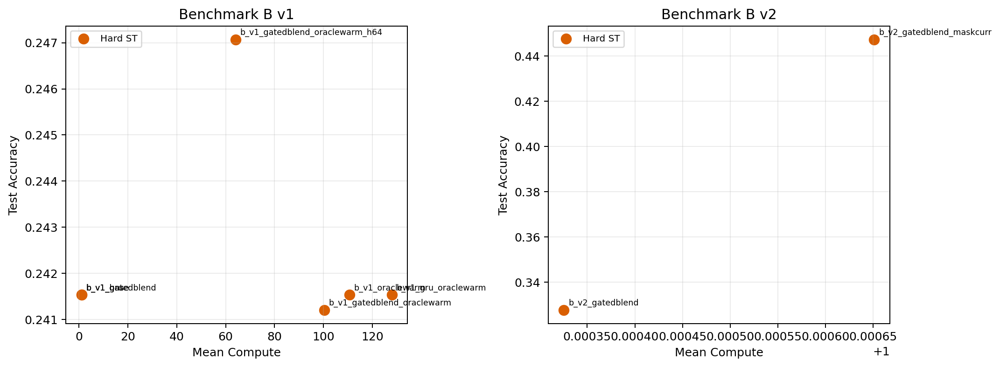
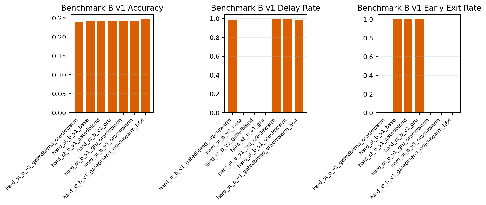
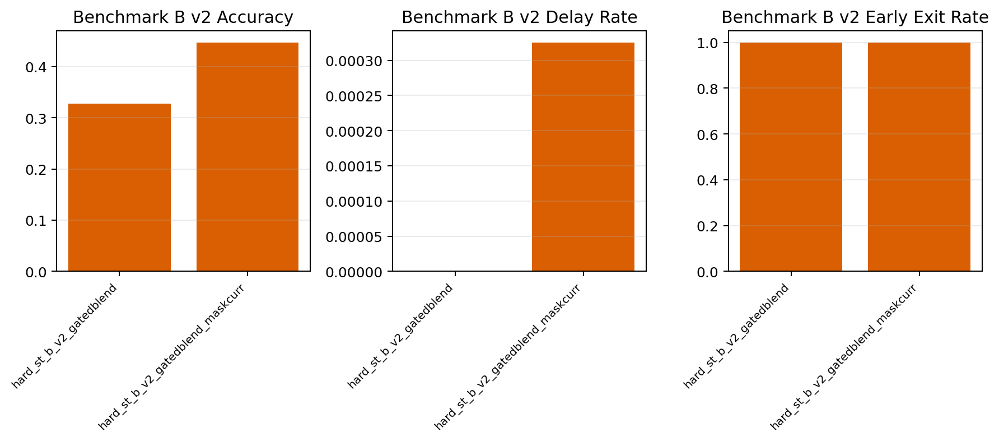
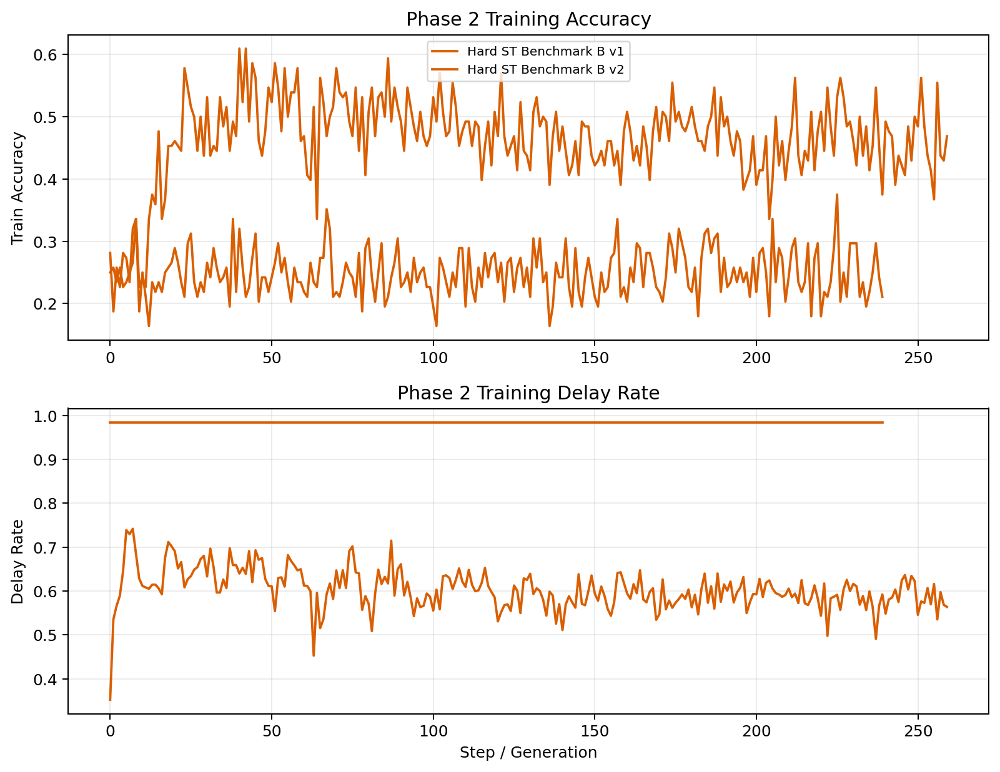

# Phase 2 Report

## Scope

Second-round investigation of the long-horizon hard-routing packet GNN with an emphasis on Benchmark B collapse, route diagnostics, and EGGROLL-inspired hybrid ES follow-ups.

## Benchmark Audit

| Benchmark | Heuristic Decode | Early-Only | Final-Only | Unique Oracle Routes | Mean Oracle Delays | Mean Delay Penalty | Break-Even CE | Delay Plausible |
| --- | --- | --- | --- | --- | --- | --- | --- | --- |
| Benchmark B v1 | 1.000 | 0.247 | 0.250 | 1 | 127.000 | 0.635 | 0.751 | True |
| Benchmark B v2 | 1.000 | 0.440 | 0.241 | 61 | 70.019 | 0.210 | 1.176 | True |

## Run Summary

| Run | Benchmark | Method | Family | Accuracy | Delay Rate | Route Match | Early Exit | Compute | Peak MB | Wall s |
| --- | --- | --- | --- | --- | --- | --- | --- | --- | --- | --- |
| hard_st_b_v1_base | Benchmark B v1 | Hard ST | baseline | 0.242 | 0.000 | 0.000 | 1.000 | 1.000 | 191.9 | 6.6 |
| hard_st_b_v1_gatedblend | Benchmark B v1 | Hard ST | gated_gru, adaptive_blend | 0.242 | 0.000 | 0.000 | 1.000 | 1.000 | 280.9 | 6.6 |
| hard_st_b_v1_gatedblend_oraclewarm | Benchmark B v1 | Hard ST | gated_gru, adaptive_blend, oracle-route | 0.241 | 0.989 | 0.038 | 0.001 | 100.256 | 1598.7 | 167.8 |
| hard_st_b_v1_gatedblend_oraclewarm_h64 | Benchmark B v1 | Hard ST | gated_gru, adaptive_blend, oracle-route | 0.247 | 0.984 | 0.994 | 0.000 | 64.006 | 838.5 | 62.6 |
| hard_st_b_v1_gru | Benchmark B v1 | Hard ST | gru | 0.242 | 0.000 | 0.000 | 1.000 | 1.000 | 288.0 | 6.4 |
| hard_st_b_v1_gru_oraclewarm | Benchmark B v1 | Hard ST | gru, oracle-route | 0.242 | 0.992 | 0.997 | 0.000 | 127.970 | 1289.7 | 100.9 |
| hard_st_b_v1_oraclewarm | Benchmark B v1 | Hard ST | oracle-route | 0.242 | 0.994 | 0.009 | 0.000 | 110.576 | 1112.7 | 96.9 |
| hard_st_b_v2_gatedblend | Benchmark B v2 | Hard ST | gated_gru, adaptive_blend | 0.328 | 0.000 | 0.256 | 1.000 | 1.000 | 246.2 | 6.9 |
| hard_st_b_v2_gatedblend_maskcurr | Benchmark B v2 | Hard ST | gated_gru, adaptive_blend, mask-curriculum | 0.447 | 0.000 | 0.256 | 0.999 | 1.001 | 3224.1 | 150.1 |

## Best Available Results

| Case | Run | Accuracy | Delay Rate | Route Match | Early Exit | Compute |
| --- | --- | --- | --- | --- | --- | --- |
| Best Hard ST v1 | hard_st_b_v1_gatedblend_oraclewarm_h64 | 0.247 | 0.984 | 0.994 | 0.000 | 64.006 |
| Best Hard ST v2 | hard_st_b_v2_gatedblend_maskcurr | 0.447 | 0.000 | 0.256 | 0.999 | 1.001 |
| Best Hybrid ES v2 | - | - | - | - | - | - |

## Per-Mode Breakdown for Benchmark B v2

| Method | Mode | Accuracy | Delay Rate | Route Match | Early Exit | Compute |
| --- | --- | --- | --- | --- | --- | --- |
| Hard ST | delay_to_final_query | 0.262 | 0.001 | 0.000 | 0.999 | 1.001 |
| Hard ST | delay_to_trigger_exit | 0.248 | 0.000 | 0.000 | 1.000 | 1.000 |
| Hard ST | easy_exit | 1.000 | 0.000 | 1.000 | 1.000 | 1.000 |

## Preliminary Phase 2 Read

- Benchmark B v1 remains a true delayed-memory task, but the route is fixed rather than adaptive; this makes it a good memory stress test and a poor pure routing benchmark.
- Benchmark B v2 is the better adaptive-routing benchmark because it mixes easy early exit with cases that should delay to a trigger or to the final query.
- The main failure mode so far is not just early-exit collapse. Under oracle-routed v1 runs, the model can be made to delay almost perfectly while still staying at chance accuracy, which points to a content-memory bottleneck.
- The adaptive delay-preservation gate creates a second failure mode: it can learn to preserve state almost perfectly, but then never writes the trigger payload. That is why phase 2 adds explicit delay-write diagnostics and a write-supervised intervention.
